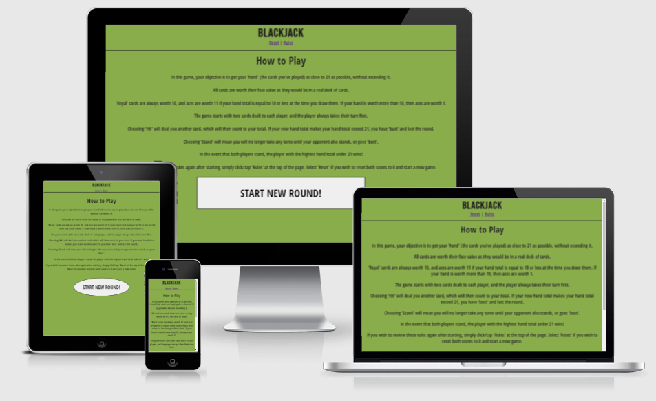
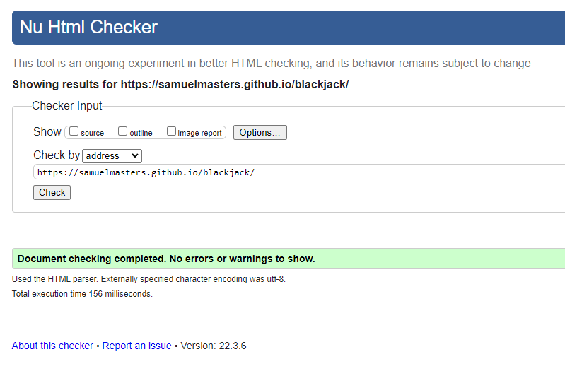
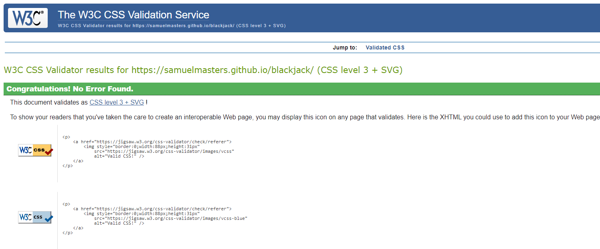
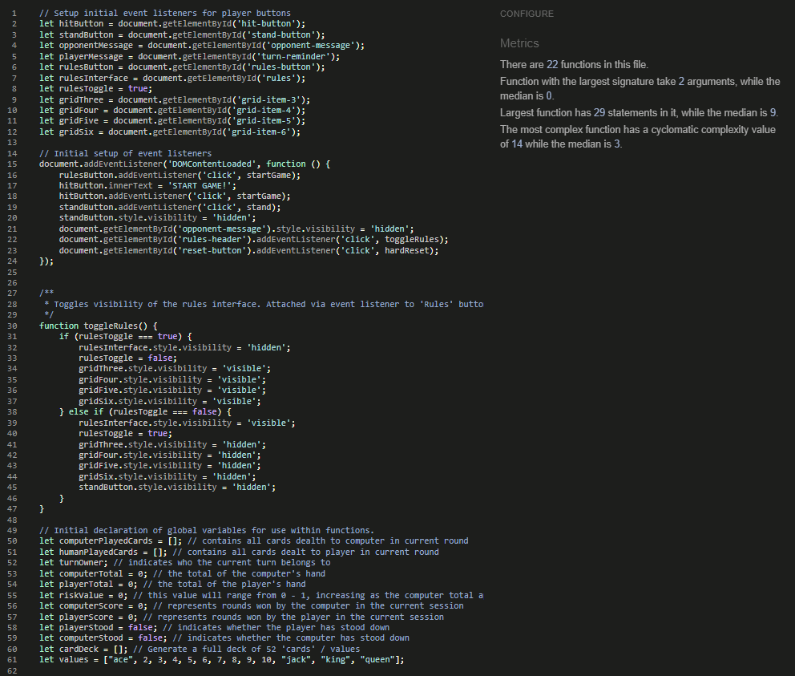
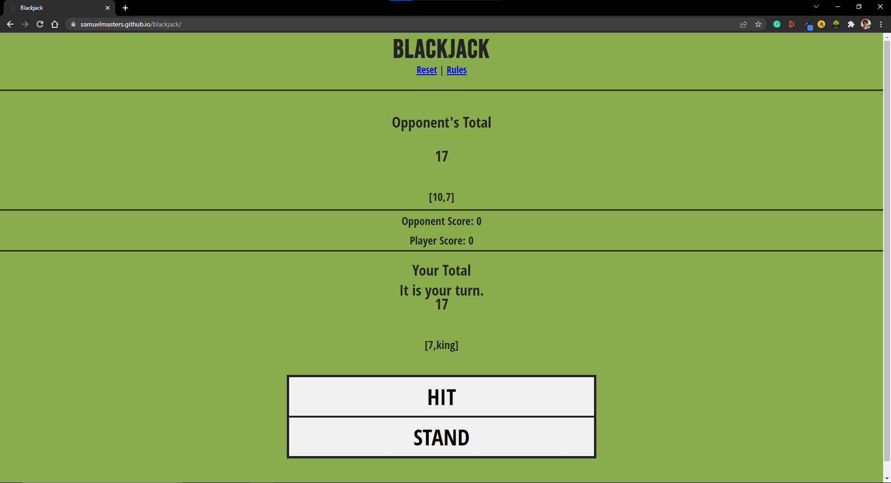
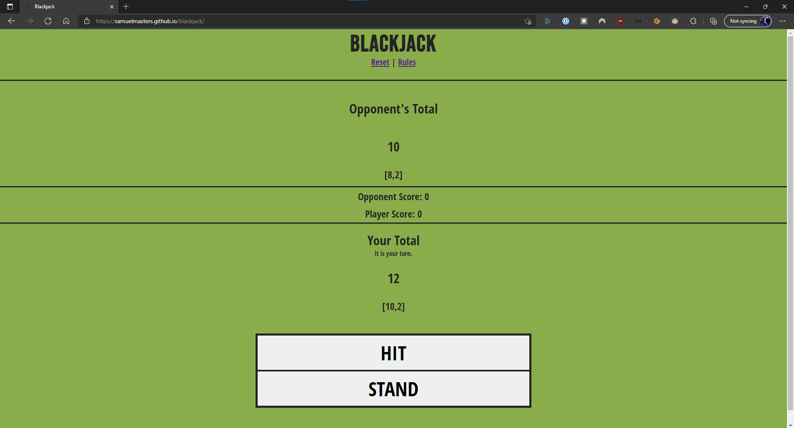
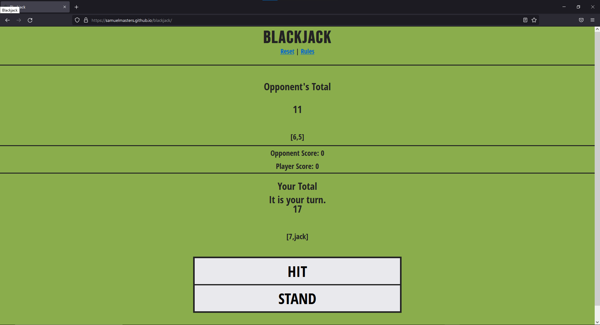

# Blackjack

## By Samuel Masters

#### This project was developed to act as my second portfolio project, based on JavaScript Essentials, as part of my Diploma in Software Development with Code Institute.

### [Click here to view the website.](https://samuelmasters.github.io/blackjack/)

### [Click here to view the public repository.](https://github.com/SamuelMasters/blackjack)

# Table of Contents:

1. [The Why](#the-why)
2. [User Experience(UX)](#user-experience-UX)
   1. [Target Audience](#target-audience)
   2. [Strategy](#strategy)
   3. [Scope](#scope)
   4. [Structure](#structure)
   5. [Skeleton](#skeleton)
      1. [Wireframes](#wireframes)
   6. [Surface](#surface)
      1. [Colours](#colours)
      2. [Typography](#typography)
      3. [Images & Icons](#images-&-icons)
3. [Features](#features)
   1. [Current Features](#current-features)
   2. [Future Features](#future-features)
4. [Technologies](#technologies)
5. [Testing](#testing)
   1. [Tests](#tests)
   2. [Bugs & Fixes](#bugs-&-fixes)
6. [Deployment](#deployment)
   1. [GitHub Pages](#github-pages)
7. [Credits](#credits)

# The Why

The purpose of the web application is to allow users to play quick rounds of a  simplified version of the popular card game 'blackjack' (AKA 21) against the computer. 

# User Experience (UX)

## Target Audience

- People who are idle for short periods of time.
- People who prefer clean, minimalist interfaces.
- People who are bored and want to play a brief, solo card game. 

## Strategy

To use a mobile-first approach to develop a web application that lets users quickly and easily jump into quick-fire rounds of blackjack, even for only a minute or two per session. Key information about how to play and how the application works are presented to the user on the landing page. 

### Project Goals

- To develop a simplified version of blackjack . 
- To inform users who might not already know how to play blackjack about the rules of the game. 
- To enable users to play quick-fire rounds of the game whilst still presenting key information in a way that avoids user confusion. 

## Scope:

The scope of the Blackjack application at the time of submission is as set out by the features below:

- Consistent 'casino green' color scheme across text content and game interface
- Information on how to play the game and the specifics of how this version of the game is played through the web app ('aces high', for example).
- Automatic calculation of hand totals, generation of a virtual 'deck of cards' (values only, no suits) from which values are randomly chosen. 
- Automatic evaluation of the winner of each round. 
- Automatic play by the computer (via JavaScript) which simulates the appearance of stategy. 
- Large, easily accessible buttons that the user can interact with to play the same, view the rules, or start a fresh game.  

If the project were to be revisited in the future, the following features would be considered:

- Image elements of actual cards that would replace the simple numerical values used in this iteration.
- Improved virtual strategy for the computer's turns, rather than the simple controlled randomness of the computer's current logic. 
- Modify the game rules to allow a player to choose whether they want to play an ace as a 11 or 1, rather than having it be automatically assigned. 

## Structure

The application's structure is very simple, and consists of only two main parts; the rules, and the game interface itself, with a simple persistent banner.

- How to Play / Rules

  - Text content informs the user on what the game is, how it is played and won, and how they can interact with the game via the 'Hit' and 'Stand' buttons. 

- Game Interface

  - The interface itself consists of your opponent (the computer's) section, the player (the user's) section, and two large buttons at the bottom of the page. 

## Skeleton

### Wireframes

Time was taken at the start of the project to determine how the interface might looks on mobile and desktop screen sizes. Additionally, the initial logic of how the game would work was considered and compiled into it's own simple text wireframe. 

These provided the initial starting point for work to begin on the project, although the design of the interface and complexity of the functions changed quite a lot by the end. 

- [Mobile](https://github.com/SamuelMasters/blackjack/blob/main/assets/wireframes/wireframe%20mobile-compressed.png)
- [Desktop](https://github.com/SamuelMasters/blackjack/blob/main/assets/wireframes/wireframe-desktop-compressed.png)
- [Functions](https://github.com/SamuelMasters/blackjack/blob/main/assets/wireframes/wireframe%20functions-compressed.png)

## Surface

### Colours

Two main colours were used for the design of the interface. 

- #8AAD4C, an light green colour, chosen for it's resemblance to the colours one might expect to see on real casino tables (a thematic choice). 
- #232323, a light shade of black, was used for all text content on the application. It contrasted well against the light green backdrop whilst still offering something sublty different from plain black text.  

---

### Typography

The font [Bebas Neue](https://fonts.google.com/specimen/Bebas+Neue?preview.text=Blackjack&preview.text_type=custom&preview.size=50) was used for the site's title in the banner, and was chosen for its striking letter sizing and naturally impactful style. A small amount of letter kerning was applied to this text to keep it easily readable.

For all other text content (including text within buttons), the [Open Sans Condensed](https://fonts.google.com/specimen/Open+Sans+Condensed) font was used. At the time of writing this README however, this font is no longer visible on Google Fonts. Therefore, those interested in using a similar font could consider the [Open Sans](https://fonts.google.com/specimen/Open+Sans#standard-styles) font instead. 

---

### Images & Icons

No images or icons were used in this project, except for the Favicon, which was sourced from the [Favicon](https://favicon.io/emoji-favicons/spade-suit) website.

---

# Features

## Current Features

- Written information informing the user how to play.  
- Score tracking for both the player and computer, showing how many rounds have been won. 
- A 'reset' button at the top of the page which enables the user to reset the scores and start fresh. 
- Two buttons which allow the user to choose whether to hit or stand on their turn.  
- Automatic handling of the computer's turns, with a basic, limited strategy taken into account. 

## Future Features

- Imagery of cards, showing their numerical value and suit. 
- 'Soft' animations of values being added or updated on the interface. 
- 'Difficulty' options that the player can choose to make the computer play more aggressively or more conservatively. 

# Technologies

## Languages

- [HTML5](https://developer.mozilla.org/en-US/docs/Web/HTML)
- [CSS3](https://developer.mozilla.org/en-US/docs/Web/CSS)
- [JavaScript](https://developer.mozilla.org/en-US/docs/Web/JavaScript)

## Other Technologies, Frameworks & Libraries

- [Google Fonts](https://fonts.google.com/)
  - Fonts were imported directly into the style sheet. 
- [Balsamiq](https://balsamiq.com/)
  - Wireframes were created directly on Balsamiq, and were used to create an initial guiding target at the start of the project's development.  
- [Canva](https://www.canva.com/colors/color-wheel/)
  - The colour wheel on Canva was used to search around for nicely contrasting colours and the ideal shade of green desired for the project. 
- [Favicon.io](https://favicon.io/emoji-favicons/soap/)
  - Favicon.io provided a compatible emoji to use for this site. 

# Testing

## Tests

### Chrome DevTools

Extensive use was made of the Chrome DevTools debugger, which allowed for slow 'stepping-through' of the code, and for subsequent identification of the causes of unexpected behaviours. Breakpoints were triggered at the point when a user would start a new round, or interact with the game interface by choosing to hit or stand. 

### [W3 HTML Validation](https://validator.w3.org/)

The single HTML document in this project passed with no errors. 
- [Index](https://validator.w3.org/nu/?doc=https%3A%2F%2Fsamuelmasters.github.io%2Fblackjack%2F)

### [Jigsaw CSS Validation](https://jigsaw.w3.org/css-validator/validator?uri=https%3A%2F%2Fsamuelmasters.github.io%2Fblackjack%2F&profile=css3svg&usermedium=all&warning=1&vextwarning=&lang=en)

This project's style.css document has been passed through the CSS validator with no errors, and successfully validates as CSS level 3 + SVG. 

### [JSHint](https://jshint.com/)

The JavaScript code written for this project was passed through JSHint, a code analysis tool, and returned no errors. It did, however, return a substantial amount of warnings regarding syntax used that was only compatible with ECMAScript 2015 / ES6. There were two features used that triggered these warnings, the use of the 'let' variable declaration keyword, and the use of template literals. If JSHint is configured to assume 'New JavaScript features' however, the code passes with no warnings. 

## Browser Compatibility
The website was tested across Chrome, Firefox, and Edge browsers and the applications' styling remained consistent across these browsers. 

- Chrome

- Edge

- Firefox

## Responsiveness

This project was created with a mobile-first approach, meaning that the layout and design was designed with a mobile screen first. Media queries were used to make the content adapt to larger screen sizes. The application was designed to be responsive from 500px gradually up to 1500px and higher. 

## Bugs & Fixes

1. Fixed -- W3 HTML Validator Errors
   - During the first round of validation, an error was returned which indicated that paragraph tags were being used incorrectly, as they contained other block-level elements within them. I resolved this error by replacing the parent elements with a section element instead of the paragraph element. 
2. Fixed -- Looping functions
   - The debugging process showed that functions were being called at the end of each round of the game when they were not supposed to, which meant at one point the game was looping itself endlessly. The was fixed by changing the order in which functions were called in the code, and refactoring some of the functions themselves to reduce multiple calls to the same function.  
3. Fixed -- Undetected 'blackjacks'
   - Extensive testing showed that when either player received the cards necessary for a 'blackjack' (any '10' card with an ace) on the opening deal, this wasn't being detected 
   as it should have been. The reason for this was that the 'royal' cards had not been converted to their numerical equivalents before this evaluation took place. This solution was to add in a call into the startGame function which handles these cards before the blackjack evaluation took place. 
4. Fixed -- Multiple computer turns running simultaneously
   - At one point, the computerTurn function was being called multiple times in what was meant to be one singluar turn for the computer, which resulted in unexpected behaviours and confusing changes to the game interface as the DOM was being updated. Reviewing the code allowed me to identify where in the process the function was being re-called, and the solution was to then remove that instance of it being called so that the function was only ever called once at a time. 
5. Fixed -- Aces not being handled correctly during opening deal 
   - A key function, handleAce, was incorrectly using restrictive conditions in its handling of aces for both the player and computer. It was set to only handle aces for the player whom the current turn belonged to. The solution was to change to the conditional statements within the function so that it evaluated both the player's and the computer's hands every time the function was called. 
6. Unresolved -- Overlayed text on 'How to Play' section
   - At submission, there is a bug where if text been made visible through DOM manipulation on the game interface, switching to the 'how to play' section by clicking the 'rules' button does not completely hide some of the text from the interface, which should be hidden. Testing has not provided an answer as to why this is happening, and the cause of the bug has not yet been identified. 

# Deployment

## Gitpod
GitPod was used as the IDE for this project. It can be setup via the following steps:
1. Install the Gitpod browser extension [here](https://chrome.google.com/webstore/detail/gitpod-always-ready-to-co/dodmmooeoklaejobgleioelladacbeki).
2. Navigate to your GitHub account and log in. 
3. Navigate to your own repository. 
4. Click the green 'Gitpod' button near the top of the page. 

## Remote deployment

GitHub Pages was used to deploy this project. 

It was achieved via the following steps: 

1. Navigate to your GitHub repository. 
2. Click on 'Settings'. 
3. On the left-hand navbar, click on 'Pages'. 
4. Under 'Source', click on the dropdown menu, and select "main". 
5. Click 'Save'. Wait a few minutes, refresh the page, and a link will be provided at the top of the page with a URL to your website. 

## Cloning the repository

If you wish to clone the repository to make a dynamic copy of this project, you may do so via the following steps: 

1. Navigate to your GitHub account and log in. 
2. Navigate to the [repository](https://github.com/SamuelMasters/blackjack). 
3. Click 'Code', and on the dropdown menu, click the copy icon alongside the provided URL. 
4. Open Gitpod in your own repository, and open a terminal. 
5. Type 'git clone ' followed by the URL you copied in the previous steps.
6. Press Enter to finish cloning of the repository.  

## Forking the repository

If you wish to fork the repository to make a static, independent copy of this project, you may do so via the following steps: 

1. Navigate to your GitHub account and log in. 
2. Navigate to the [repository](https://github.com/SamuelMasters/blackjack). 
3. In the top-right corner, click 'Fork'. 
4. You should now have a copy of the original repository amongst your other repositories. 

Copying a repository in this way allows you to make changes to the code without affecting the original project, and can be useful for experimentation. 

---

# Credits

1. [Code Institute](https://codeinstitute.net/)
   - For providing me with the knowledge and skills to develop this project, and for supporting my learning journey. 
2. [W3Schools](https://www.w3schools.com/)
   - This website provided a handy, quick reference for checking syntax of the JavaScript included in this project. 
3. [Chris Quinn](https://github.com/10xOXR)
   - A big thank you to Chris, who's advice has been invaluable whilst working on this project.   
4. [Favicon.io](https://favicon.io/)
   - The site's favicon was found on the website [favicon.io](https://favicon.io/) and was used in this project under the [Creative Commons 4.0 license](https://creativecommons.org/licenses/by/4.0/legalcode). The icon was available as part of the open source [Twemoji](https://github.com/twitter/twemoji/blob/master/assets/svg/1f9fc.svg) project. 
4. [Tutorial Republic](https://www.tutorialrepublic.com/faq/how-to-find-the-sum-of-an-array-of-numbers-in-javascript.php)
   - This page helped me to understand how to find the sum of an numerical array, and their code example was adapted for use in my own work (comments annotate this code in the script.js file). 
